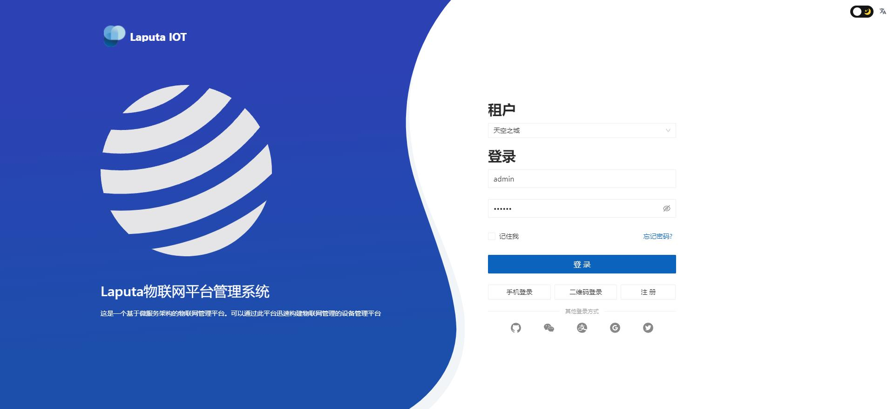
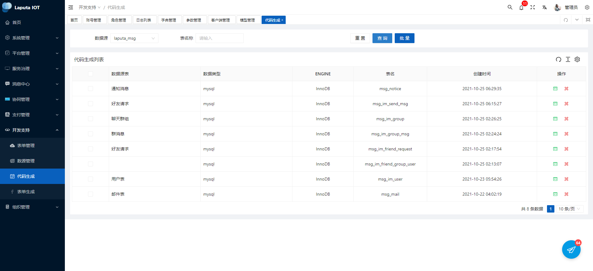
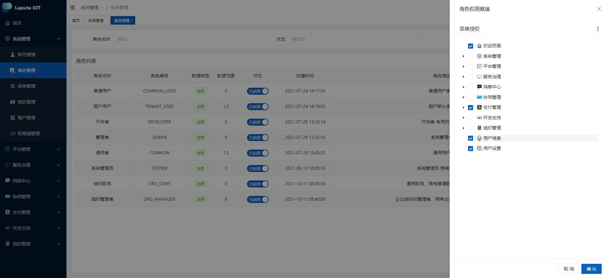
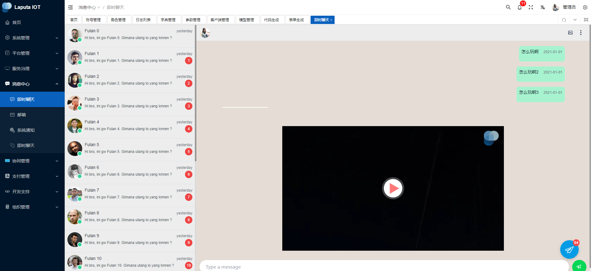
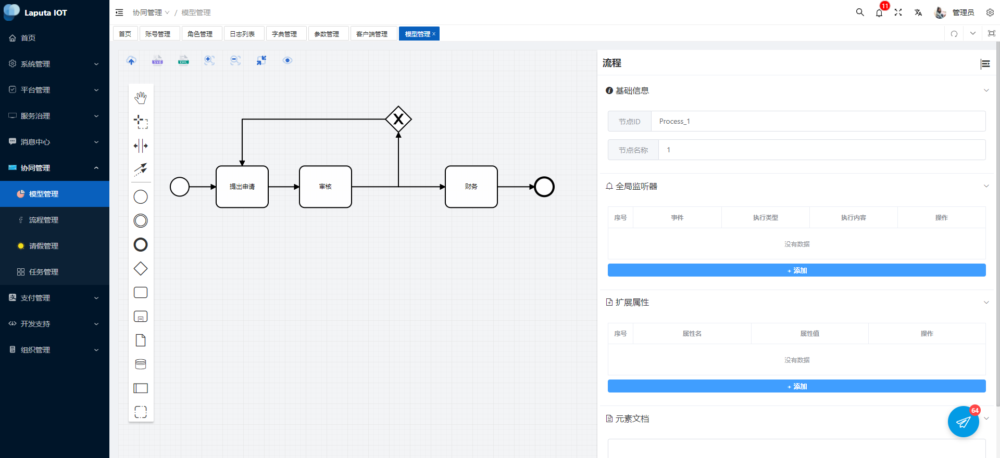
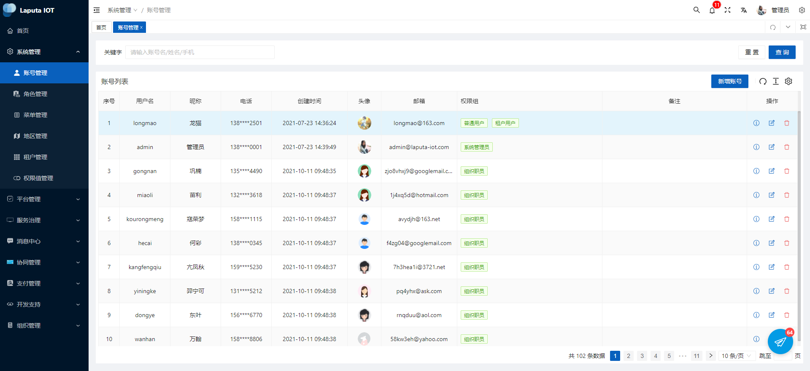
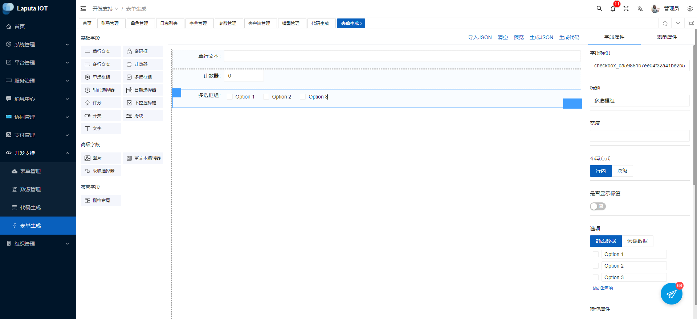
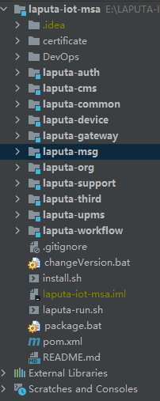

# Laputa-IOT-MSA

  

   Laputa-IOT-MSA，一个基于微服务架构的前后端分离物联网中台

<a target="_blank" href="https://gitee.com/moxi159753/mogu_blog_v2">
    	</img>
		</img>
        </img>
</img>
</img>
</img>
</img>
</a>

[项目介绍](#项目介绍) | [站点演示](#站点演示) | [项目特点](#项目特点) | [技术架构](#技术选型) | [项目目录](#项目目录) | [项目文档](#项目文档)  | [快速开始](#快速开始) | [视频教程](#视频教程)| [项目截图](#移动端截图) | [更新记录](https://gitee.com/moxi159753/mogu_blog_v2/releases) | [笔记仓库](https://gitee.com/moxi159753/LearningNotes)

##  前言

项目已有较详细的  [项目搭建文档](http://moxi159753.gitee.io/mogu_blog_doc) ，同时包括了 **Windows**、**Linux** 以及 **Docker** 环境下Laputa IOT 物联网平台的搭建。在使用过程中遇到问题时，首先认真阅读**项目搭建文档** ，同时 [FAQ文档](http://www.moguit.cn/#/info?blogOid=288) 还收集了小伙伴咨询的问题，可以提前阅读~

【提问前】可以先 [百度](https://www.baidu.com/) 或者 [Google](https://www.google.com/) 进行解决，有的问题通过**搜索引擎**很快就能得到解决

【提问前】可以首先看看 [issue](https://gitee.com/moxi159753/mogu_blog_v2/issues) 或者  [FAQ文档](http://www.moguit.cn/#/info?blogOid=288)，可能你的问题别人也遇到过

【提问前】可以提前阅读 [如何向开源社区提问题](http://www.moguit.cn/#/info?blogUid=b0f76c94a81fa3b815f8e39e4dc889f8)

【提问】推荐使用 [Gitee issue](https://gitee.com/moxi159753/mogu_blog_v2/issues) 进行提问，因为issue解决后能够保留解决记录，帮助其它小伙伴避坑。其次可以使用  <a href="##关注&交流">QQ群 </a>  或者 <a href="##前言">微信群 </a> 进行提问。群里提问注意提问的时间，把遇到**问题的详细过程都描述清楚**，最好**配上图文信息**，这样能有利于更高效的解决问题。

# 项目部署
mvn clean install -DskipTests

# laputa-iot
127.0.0.1 register.laputa-iot.com 
127.0.0.1 gateway.laputa-iot.com 
127.0.0.1 redis.laputa-iot.com 
127.0.0.1 xxl.laputa-iot.com 
127.0.0.1 mysql.laputa-iot.com 
127.0.0.1 sentinel.laputa-iot.com 
127.0.0.1 monitor.laputa-iot.com 

127.0.0.1 laputa-register 
127.0.0.1 laputa-gateway 
127.0.0.1 laputa-redis 
127.0.0.1 laputa-xxl 
127.0.0.1 laputa-mysql 
127.0.0.1 laputa-sentinel 
127.0.0.1 laputa-monitor 
127.0.0.1 laputa-mqtt 
127.0.0.1 laputa-es 
127.0.0.1 laputa-rq 

## 后期维护

- **master** 分支为主分支，是基于 **Nacos** 分支的稳定版本

## 项目介绍

Laputa IOT 物联网平台( **Laputa IOT** )，一个**基于微服务架构的前后端分离物联网管理平台系统**。**Web** 端使用 **Vue** + **ElementUi** , 移动端使用 **uniapp** 和 **ColorUI**。后端使用 **SpringCloud** + **SpringBoot** + **Mybatis-plus**进行开发，使用 **Jwt** + **SpringSecurity** 做登录验证和权限校验，使用 **ElasticSearch** 和 **Solr** 作为全文检索服务，使用 **Github Actions**完成博客的持续集成，使用 **ElasticStack** 收集博客日志，文件支持**上传本地**、**七牛云** 和 **Minio**.

- Laputa IOT 物联网平台大部分功能是我个人进行开发的，因能力有限，其中很多技术都是一边学习一边使用的，可以说Laputa IOT 物联网平台也是一个我用来熟悉技术的项目，所以很多地方可能考虑不周，故有能改正的地方，还请各位老哥能够指出~
- 现在挺多是SSM或者SSH的物联网管理系统，想用 **SpringBoot** + **SpringCloud**  + **Vue** 的微服务架构进行尝试项目的构建，里面很多功能可能只是**为了满足自己的学习需求**而引入的，大家可以**根据自己服务器配置来选择启动的服务**，因此本物联网也是一个非常好的 **SpringBoot**、**SpringCloud**以及 **Vue** 技术的入门学习项目。
- 原来做过 **Vue** + **ElementUi** 做过管理系统，所以现在打算做一套自己的、基于当前最新技术栈、前后端分离的微服务物联网管理平台。
- [Laputa IOT 物联网平台]中的一些文章，很多都来自我平时的学习笔记，里面涵盖了 **JVM**、**JUC**、**Java**，**Spring**，**SpringCloud**，计算机网络，操作系统，数据结构，**Vue**、**Linux** 等 ，感兴趣的小伙伴可以跳转该仓库一下

## 站点演示

## 项目中初始用户和密码

- **后台登录**：用户：admin，密码：123456
- 前台登录：用户：admin，密码：123456
- **Mysql**：用户：root，密码：Laputa@123456
- **Redis**：密码：Laputa@123456
- **远程SSH初始密码**：用户：root，密码：Yvonne@1227
- **RabbitMQ管理页面：** 用户：admin，密码：Yvonne@1227
- **Nacos管理页面：** 用户：nacos，密码：nacos
- **Sentinel管理页面：** 用户：sentinel，密码：sentinel
- **Laputa IOT 物联网平台监控页面**：用户：laputa，密码：laputa
- **Druid初始密码：** 用户：admin，密码：123456

## 运行配置

Laputa IOT 物联网平台使用了一些监控的 **SpringCloud** 组件，但是并不一定都需要部署，必须启动的服务包含

`nacos`，`nginx`，`rabbitmq`， `redis`，`mysql`，`laputa-gateway`，`laputa-sms`，`laputa-picture`， `laputa-web`, `laputa-admin`

## 项目特点

- 友好的代码结构及注释，便于阅读及二次开发
- 实现前后端分离，通过 **Json** 进行数据交互，前端再也不用关注后端技术
- 页面交互使用 **Vue3.x Typescript**，极大的提高了开发效率。
- 引入**Swagger** 文档支持，方便编写 **API** 接口文档。
- 引入**RabbitMQ** 消息队列，用于邮件发送、更新 **Redis** 和 **Solr**
- 引入**JustAuth** 第三方登录开源库，支持 **Gitee**、**Github** 账号登录。
- 引入**ElasticSearch** 作为全文检索服务，并支持可插拔配置
- 引入**Github Actions** 工作流，完成Laputa IOT 物联网平台的持续集成、持续部署。
- 引入MINIO fastdfs 阿里云 七牛云等对象存储，同时支持本地文件存储
- 引入 **RBAC** 权限管理设计，灵活的权限控制，按钮级别的细粒度权限控制，满足绝大部分的权限需求
- 引入 **Zipkin** 链路追踪，聚合各业务系统调用延迟数据，可以一眼看出延迟高的服务
- 采用**自定义参数校验注解**，轻松实现后端参数校验
- 采用 **AOP** + 自定义注解 + **Redis** 实现限制IP接口访问次数
- 采用自研的评论模块，实现评论邮件通知
- 采用 **Nacos** 作为服务发现和配置中心，轻松完成项目的配置的维护
- 采用 **Sentinel** 流量控制框架，通过配置再也不怕网站被爆破
- 采用[uniapp](https://uniapp.dcloud.io/) 和[ColorUi](https://github.com/weilanwl/ColorUI) 完成Laputa IOT 物联网平台的移动端门户页面搭建
- 支持多种文本编辑器，**Markdown** 编辑器([Vditor](https://github.com/Vanessa219/vditor))和富文本编辑器([CKEditor](https://github.com/ckeditor/ckeditor4))随心切换
- 采用 **ElasticStack**【**ElasticSearch** + **Beats** + **Kibana** + **Logstash**】[搭建Laputa IOT 物联网平台日志收集]
- 采用 **Docker Compose** 完成容器编排，**Portainer** 实现容器可视化，支持[一键部署线上环境]

## 项目目录

- Laputa IOT 是一款基于最新技术开发的多人在线、简洁的物联网管理平台。
- laputa-upms-service: 提供admin端API接口服务；
- laputa-web：提供web端API接口服务；
- laputa-register： 服务发现和注册
- laputa-picture： 图片服务，用于图片上传和下载；
- laputa-notification：消息服务，用于更新ElasticSearch、邮件和短信发送
- laputa-monitor：监控服务，集成SpringBootAdmin用于管理和监控SpringBoot应用程序
- laputa-gateway：网关服务`（目前还未完善）`
- laputa-zipkin：链路追踪服务，`目前使用java -jar的方式启动`
- laputa-search：搜索服务，ElasticSearch作为全文检索工具，[支持可插拔配置](http://moguit.cn/#/info?blogUid=4042b4f4088e4e37e95d9fc75d97298b)，默认使用SQL搜索
- laputa-commons：公共模块，主要用于存放Entity实体类、Feign远程调用接口、以及公共config配置
- laputa-utils: 是常用工具类；
- laputa-xo: 是存放 VO、Service，Dao层的
- laputa-common: 是一些Common的基类， 和工具类的starter
- doc: 是Laputa IOT 物联网平台的一些文档和数据库文件
- vue_laputa-admin：VUE的后台管理页面
- vue_laputa-web：VUE的门户网站
- uniapp_laputa-web：基于uniapp 和 colorUi 的Laputa IOT 物联网平台移动端门户页面（Nacos分支）
- nuxt_laputa-web：Nuxt的门户网站，主要用于支持SEO搜索引擎优化`（目前还未完善）`

## 技术选型

### 系统架构图

>  Laputa IOT 物联网平台系统架构图，使用 [Processon](https://www.processon.com/i/5e380df1e4b05b335ffa81e9) 在线绘制

### 后端技术

### 后端技术栈

| 技术                           | 名称                        | 官网                                                   |
| ------------------------------ | --------------------------- | ------------------------------------------------------ |
| Spring Cloud                   | 分布式微服务框架            | https://projects.spring.io/spring-cloud                |
| Spring Boot                    | 快速应用开发Spring框架      | https://spring.io/projects/spring-boot                 |
| Netty                          | NIO框架                     | https://github.com/netty/netty                         |
| Spring session                 | 分布式Session管理           | http://projects.spring.io/spring-session               |
| Spring Data JPA                | ORM框架（基于hibernate）    | https://spring.io/projects/spring-data-jpa             |
| MyBatis                        | ORM框架                     | http://www.mybatis.org/mybatis-3/zh/index.html         |
| pagehelper-spring-boot-starter | MyBatis物理分页插件         | https://github.com/pagehelper/pagehelper-spring-boot   |
| Druid                          | 数据库连接池                | https://github.com/alibaba/druid                       |
| Redis                          | 分布式缓存数据库            | https://redis.io                                       |
| Kafka                          | 消息中间件                  | http://kafka.apache.org                                |
| Apollo                         | 分布式配置中心              | https://github.com/ctripcorp/apollo                    |
| Eureka                         | 服务发现框架                | https://github.com/Netflix/eureka                      |
| OpenFeign                      | 远程RPC调用框架             | https://github.com/spring-cloud/spring-cloud-openfeign |
| Feign-form                     | Feign远程传输二进制文件工具 | https://github.com/OpenFeign/feign-form                |
| Zuul                           | API网关框架                 | https://github.com/Netflix/zuul                        |
| Hystrix                        | 容错框架                    | https://github.com/Netflix/Hystrix                     |
| Maven                          | 项目构建管理                | http://maven.apache.org                                |
| SpringSecurity |      认证和授权框架       |          https://spring.io/projects/spring-security          |
| MyBatis-Plus  |          ORM框架          |                   https://mp.baomidou.com/                   |
| Swagger-UI   |       文档生产工具        | [ https://github.com/swagger-api/swagger-ui](https://github.com/swagger-api/swagger-ui) |
| Kibana     |     分析和可视化平台      |               https://www.elastic.co/cn/kibana               |
| Elasticsearch  |         搜索引擎          | [ https://github.com/elastic/elasticsearch](https://github.com/elastic/elasticsearch) |
| Beats      |     轻量型数据采集器      |               https://www.elastic.co/cn/beats/               |
| Logstash    | 用于接收Beats的数据并处理 |              https://www.elastic.co/cn/logstash              |
| RabbitMQ    |         消息队列          |   [ https://www.rabbitmq.com/](https://www.rabbitmq.com/)    |
|     Redis      |        分布式缓存         |                      https://redis.io/                       |
|     Docker     |        容器化部署         |      [ https://www.docker.com](https://www.docker.com/)      |
|     Druid      |       数据库连接池        | [ https://github.com/alibaba/druid](https://github.com/alibaba/druid) |
|     七牛云      |     七牛云 - 对象储存     |         https://developer.qiniu.com/sdk#official-sdk         |
|      JWT       |        JWT登录支持        |                 https://github.com/jwtk/jjwt                 |
|     SLF4J      |         日志框架          |                    http://www.slf4j.org/                     |
|     Lombok     |     简化对象封装工具      | [ https://github.com/rzwitserloot/lombok](https://github.com/rzwitserloot/lombok) |
|     Nginx      |  HTTP和反向代理web服务器  |                      http://nginx.org/                       |
|    JustAuth    |     第三方登录的工具      |             https://github.com/justauth/JustAuth             |
|     Hutool     |      Java工具包类库       |                  https://hutool.cn/docs/#/                   |
|     阿里大于     |       短信发送平台        |            https://doc.alidayu.com/doc2/index.htm            |
|    Jenkins     |        自动化部署         |              https://www.jenkins.io/zh/              |
|     Zipkin     |         链路追踪          |             https://github.com/openzipkin/zipkin             |
| Flexmark-java  |     Markdown转换Html      |            https://github.com/vsch/flexmark-java             |
|   Ip2region    |     离线IP地址定位库      |          https://github.com/lionsoul2014/ip2region           |
|     Minio      |     本地对象存储服务      |                       https://min.io/                        |

### DEVOPS

|         技术          |                  说明                    |                             官网                             |
| :-------------------: | :-------------------------------------: | :----------------------------------------------------------: |
| Docker Compose |      Docker容器编排       |               https://docs.docker.com/compose/               |
|   Portainer    |     Docker可视化管理      |            https://github.com/portainer/portainer            |
|   Kubernetes    |     Docker容器管理     |            https://www.kubernetes.org.cn/k8s            |

### 前端技术

|         技术          |                  说明                   |                             官网                             |
| :-------------------: | :-------------------------------------: | :----------------------------------------------------------: |
|        Vue.js         |                前端框架                 |                      https://vuejs.org/                      |
|      Vue-router       |                路由框架                 |                  https://router.vuejs.org/                   |
|         Vuex          |            全局状态管理框架             |                   https://vuex.vuejs.org/                    |
|        Nuxt.js        |        创建服务端渲染 (SSR) 应用        |                    https://zh.nuxtjs.org/                    |
|        Element        |               前端ui框架                |    [ https://element.eleme.io](https://element.eleme.io/)    |
|         Axios         |              前端HTTP框架               | [ https://github.com/axios/axios](https://github.com/axios/axios) |
|        Echarts        |                图表框架                 |                      www.echartsjs.com                       |
|       CKEditor        |              富文本编辑器               |                    https://ckeditor.com/                     |
|     Highlight.js      |            代码语法高亮插件             |         https://github.com/highlightjs/highlight.js          |
|        Vditor         |             Markdown编辑器              |             https://github.com/Vanessa219/vditor             |
|      vue-cropper      |              图片裁剪组件               |           https://github.com/xyxiao001/vue-cropper           |
| vue-image-crop-upload |           vue图片剪裁上传组件           |      https://github.com/dai-siki/vue-image-crop-upload       |
|   vue-emoji-comment   |          Vue Emoji表情评论组件          |       https://github.com/pppercyWang/vue-emoji-comment       |
|     clipboard.js      |            现代化的拷贝文字             |                  http://www.clipboardjs.cn/                  |
|      js-beautify      |           美化JavaScript代码            |         https://github.com/beautify-web/js-beautify          |
|     FileSaver.js      |            保存文件在客户端             |           https://github.com/eligrey/FileSaver.js            |
|      SortableJS       |       功能强大的JavaScript 拖拽库       |                  http://www.sortablejs.com/                  |
|   vue-side-catalog    |               目录导航栏                |        https://github.com/yaowei9363/vue-side-catalog        |
|        uniapp         |            移动端跨平台语言             |                  https://uniapp.dcloud.io/                   |
|        colorUi        |         专注视觉的小程序组件库          |             https://github.com/weilanwl/ColorUI              |
|       showdown        | 用Javascript编写的Markdown 到Html转换器 |            https://github.com/showdownjs/showdown            |
|       turndown        | 用JavaScript编写的HTML到Markdown转换器  |           https://github.com/domchristie/turndown            |

## 快速开始

### [推荐] Windows+VMware一键搭建Laputa IOT 物联网平台本地开发环境

参考 [Windows+VMware一键搭建Laputa IOT 物联网平台本地开发环境](http://www.moguit.cn/#/info?blogOid=583)，快速在 **Windows** 平台搭建Laputa IOT 物联网平台开发环境，将中间件安装在 **VMware** 中。

### Windows环境下搭建Laputa IOT 物联网平台

参考 [window环境下配置Laputa IOT 物联网平台环境](http://www.moguit.cn/#/info?blogUid=082ca226cf2e4103b0ffa6e6c13d7b14)，能够在 **Windows**下搭建Laputa IOT 物联网平台的开发环境，同时将**所有组件**安装在**Windows** 环境中

### [推荐] DockerCompose一键部署Laputa IOT 物联网平台(Nacos版)

参考 [DockerCompose一键部署Laputa IOT 物联网平台(Nacos版)](http://www.moguit.cn/#/info?blogOid=565) ，在 **Linux** 服务器中，一键完成Laputa IOT 物联网平台项目的部署

### Docker搭建Laputa IOT 物联网平台

参考 [使用Docker快速搭建Laputa IOT 物联网平台(Eureka分支)](http://www.moguit.cn/#/info?blogUid=ab8377106a0d4b9f8d66131e4312c69e)，快速在Linux服务器中搭建好物联网运行环境，通过发布 **Jar** 包的方式完成部署

参考 [使用Docker快速搭建Laputa IOT 物联网平台(Nacos分支)](http://moguit.cn/#/info?blogUid=8100dcb585fff77e3fa25eed50e3708e)，快速在Linux服务器中搭建好物联网运行环境，通过发布 **Jar** 包的方式完成部署

### Laputa IOT 物联网平台部署到云服务器

【**推荐**】参考[IDEA发布Laputa IOT 物联网平台Docker镜像到云服务器(适用于DockerCompose部署)](http://moguit.cn/#/info?blogOid=588)，在你修改Nacos分支物联网源码后，将重新制作镜像部署到云服务器，然后通过DockerCompose进行启动。

参考[Laputa IOT 物联网平台如何部署到阿里云服务器(Eureka分支)](http://www.moguit.cn/#/info?blogUid=89defe3f4a3f317cba9aa0cdb9ff879e)，在你修改Eureka分支物联网源码后将项目打包部署到云服务器

参考[Laputa IOT 物联网平台如何部署到阿里云服务器(Nacos分支)](http://www.moguit.cn/#/info?blogUid=ecde4ce178bdc1a241e9f9ddd9052013)，在你修改Nacos分支物联网源码后将项目打包部署到云服务器

### 使用Github Actions完成Laputa IOT 物联网平台持续集成

参考 [使用Github Action完成Laputa IOT 物联网平台持续集成](http://moguit.cn/#/info?blogUid=0762bfb392c2cf0a94c8a7934fe46f8f) ，在你提交一个 **push** 请求后，通过 **Github Actions** 能够完成Laputa IOT 物联网平台自动化 编译、打包、部署等操作。

### 切换搜索模式

参考[Laputa IOT 物联网平台切换搜索模式](http://moguit.cn/#/info?blogUid=4042b4f4088e4e37e95d9fc75d97298b)，完成Laputa IOT 物联网平台的搜索引擎切换，目前支持 **Solr**、**ElasticSearch**、**SQL** 的方式

### 配置七牛云对象存储

参考[Laputa IOT 物联网平台切换七牛云存储](http://moguit.cn/#/info?blogUid=735ed389c4ad1efd321fed9ac58e646b)，配置文件的七牛云对象存储，及本地文件存储

### 使用Zipkin搭建Laputa IOT 物联网平台链路追踪

参考[使用Zipkin搭建Laputa IOT 物联网平台链路追踪](http://moguit.cn/#/info?blogUid=35bd93cabc08611c7f74ce4564753ef9)，通过聚合各业务系统调用延迟数据，达到链路调用监控跟踪，快速定位其中延迟高的服务

### 使用Nacos搭建Laputa IOT 物联网平台服务注册和配置中心

参考[Laputa IOT 物联网平台Nacos部署指南](http://www.moguit.cn/#/info?blogUid=8dc52bd61e36fa56cfc7699815375572)，搭建Laputa IOT 物联网平台的服务注册和配置中心

### 使用Sentinel搭建Laputa IOT 物联网平台流量控制

参考[Laputa IOT 物联网平台Sentinel安装指南](http://www.moguit.cn/#/info?blogUid=7135efc7f536769efd0d0483c687ba07)，**Sentinel** 被称为分布式系统的流量防卫兵，相当于Hystrix

### Laputa IOT 物联网平台小程序发布

参考[Laputa IOT 物联网平台QQ小程序发布指南](http://www.moguit.cn/#/info?blogUid=80d3eae77c16cea10e119b9f1a1da4c8)，完成Laputa IOT 物联网平台 **uniapp** 移动端的启动和发布

### Laputa IOT 物联网平台扩展新的功能和页面

参考[Laputa IOT 物联网平台如何扩展新的功能和页面](http://moguit.cn/#/info?blogUid=4eb7694c58cf8205885b1e8565b1a94e)，在Laputa IOT 物联网平台现有架构基础上，开发自己需要的页面。

###  使用ELK搭建Laputa IOT 物联网平台日志收集

参考[搭建Laputa IOT 物联网平台日志收集](https://gitee.com/moxi159753/LearningNotes/tree/master/ElasticStack/6_%E4%BD%BF%E7%94%A8ELK%E6%90%AD%E5%BB%BA%E8%98%91%E8%8F%87%E5%8D%9A%E5%AE%A2%E6%97%A5%E5%BF%97%E6%94%B6%E9%9B%86)，使用 **Docker** 快速搭建 **ELK** 环境用于Laputa IOT 物联网平台日志收集

## 环境搭建

### 开发工具

|     工具     |       说明        |                             官网                             |
| :----------: | :---------------: | :----------------------------------------------------------: |
|     IDEA     |    Java开发IDE    |           https://www.jetbrains.com/idea/download            |
|   WebStorm   |    前端开发IDE    |             https://www.jetbrains.com/webstorm/              |
| RedisDesktop |  Redis可视化工具  | [ https://redisdesktop.com/download](https://redisdesktop.com/download) |
| SwitchHosts  |   本地Host管理    |             https://oldj.github.io/SwitchHosts/              |
|   X-shell    | Linux远程连接工具 |               https://xshell.en.softonic.com/                |
|    X-ftp     | Linux文件传输工具 |         https://www.netsarang.com/zh/all-downloads/          |
|    SQLyog    |  数据库连接工具   |               https://sqlyog.en.softonic.com/                |
| ScreenToGif  |    Gif录制工具    | [ https://www.screentogif.com/](https://www.screentogif.com/) |

### 开发环境

|     工具      | 版本号 |                             下载                             |
| :-----------: | :----: | :----------------------------------------------------------: |
|      JDK      |  1.8   | https://www.oracle.com/technetwork/java/javase/downloads/jdk8-downloads-2133151.html |
|     Maven     | 3.3.0+ |                   http://maven.apache.org/                   |
| Elasticsearch | 6.3.0  |               https://www.elastic.co/downloads               |
|     Solr      |  7.0   |                http://lucene.apache.org/solr/                |
|     MySQL     |  5.6   |                    https://www.mysql.com/                    |
|    Erlang     |  20.3  |                   https://www.erlang.org/                    |
|   RabbitMQ    | 3.7.4  |            http://www.rabbitmq.com/download.html             |
|     Nginx     |  1.10  |              http://nginx.org/en/download.html               |
|     Redis     | 3.3.0  |                  https://redis.io/download                   |
|    Zipkin     | 2.12.5 | https://search.maven.org/remote_content?g=io.zipkin.java&a=zipkin-server&v=LATEST&c=exec |
|     Nacos     | 1.3.2  |          https://github.com/alibaba/nacos/releases           |
|   Sentinel    | 1.7.2  |         https://github.com/alibaba/Sentinel/releases         |

## 致谢

**Laputa IOT 物联网平台**起初参考了很多**开源项目**的**解决方案**，**开源不易，感谢分享**

- 感谢 **[jetbrains](https://www.jetbrains.com/?from=laputa-blog_v2)** 提供的开源License 

- 感谢**杨青小姐姐**的物联网模板：[http://www.yangqq.com/](http://www.yangqq.com/)
- 感谢**PanJiaChen**的Vue后台管理模板：[vue-element-admin](https://github.com/PanJiaChen/vue-element-admin)
- Vue项目搭建参考这篇物联网：[https://segmentfault.com/a/1190000009506097](https://segmentfault.com/a/1190000009506097)
- 感谢**苞米豆**提供的 **Mybatis-plus**框架：[http://mp.baomidou.com/](http://mp.baomidou.com/)
- 感谢**yadong.zhang**提供的第三方登录开源库：[https://gitee.com/yadong.zhang/JustAuth](https://gitee.com/yadong.zhang/JustAuth)
- 感谢 **bihell** 的 **Dice** 物联网项目：[https://github.com/bihell/Dice](https://github.com/bihell/Dice)
- 感谢 **pppercyWang** 提供的Emoji表情评论组件：[vue-emoji-comment](https://github.com/pppercyWang/vue-emoji-comment)
- 感谢 **若依** 提供的 **RuoYi** 项目：[https://gitee.com/y_project/RuoYi](https://gitee.com/y_project/RuoYi)
- 感谢 **yaowei9363** 提供的 **Vue侧目录组件**： [vue-side-catalog](https://github.com/yaowei9363/vue-side-catalog) 
- 感谢 **奇文社区** 提供的 **奇文网盘** 项目：https://gitee.com/qiwen-cloud/qiwen-file
- 感谢 **weilanwl** 提供的 **ColorUI**：https://github.com/weilanwl/ColorUI

## 关注&交流

为了方便小伙伴们沟通交流，我创建了QQ群 (**加群备注**：`Laputa IOT 物联网平台`) ，目前项目还存在很多不足之处，欢迎各位老哥进群进行技术交流，为了防止广告进入，希望加群的时候能添加备注，谢谢~

|         ~~QQ群（备注：`Laputa IOT 物联网平台`）【群满】~~          |            QQ群（备注：`Laputa IOT 物联网平台`）【推荐】            | QQ群（备注：`Laputa IOT 物联网平台`）                               |
| :---------------------------------------------------: | :----------------------------------------------------: | ------------------------------------------------------ |
|  |  |  |

## 未来计划

- [x] 集成Github Actions，完成Laputa IOT 物联网平台持续集成服务
- [x] 门户网站增加登录页面
- [x] 支持第三方登录
- [x] 集成ElasticSearch和Solr
- [x] 将图片存储在七牛云中
- [x] 写一个评论模块，用于替换搜狐畅言
- [x] 按钮级别的细粒度权限控制
- [x] 增加评论表情
- [x] 增加数据字典管理
- [x] 前端增加用户个人中心
- [x] 增加一个FAQ常见问题文档
- [x] 集成表单构建页面，来源于[RuoYi](https://gitee.com/y_project/RuoYi)
- [x] 增加物联网详情页目录导航，来源于[vue-side-catalog](https://github.com/yaowei9363/vue-side-catalog)
- [x] 资源管理页面集成网盘管理
- [x] 使用Sentinel做服务限流和熔断
- [x] 增加Laputa IOT 物联网平台小程序项目 uniapp_laputa-web，基于[ColorUI](https://github.com/weilanwl/ColorUI) 和 [Uniapp](https://uniapp.dcloud.io/)
- [x] 富文本编辑器和Markdown编辑器任意切换
- [x] 使用ELK搭建[Laputa IOT 物联网平台日志收集功能](http://www.moguit.cn/#/info?blogUid=fd9ab58588d93ef792ec72a359a09f6c)
- [x] 使用Minio [搭建对象存储服务](http://www.moguit.cn/#/info?blogUid=a1058b2d030310e2c5d7b0584e514f1f)
- [x] 使用DockerCompose完成 [物联网一键部署](http://www.moguit.cn/#/info?blogOid=565)
- [x] 使用Portainer对Docker镜像可视化管理
- [x] 适配门户页面的移动端布局
- [x] 完善网盘管理
- [x] 增加更新记录
- [x] 完善爬虫模块
- [x] 完善网关模块
- [ ] 增加K8S部署Laputa IOT 物联网平台教程
- [ ] 增加大屏数据展示页面
- [ ] 增加定时任务模块
- [ ] 使用Freemark页面静态化技术对物联网详情页静态化
- [ ] 解决Nuxt_laputa-web中存在的问题，使物联网能被搜索引擎收录
- [ ] 让原创文章能够同步到多平台，如：CSDN，掘金，物联网园等

## 贡献代码

开源项目离不开大家的支持，如果您有好的想法，遇到一些 **BUG** 并修复了，以及 [Laputa IOT 物联网平台文档](https://gitee.com/moxi159753/laputa-blog_doc) 上有错误的地方订正过来了，欢迎小伙伴们提交 **Pull Request** 参与开源贡献

1. **fork** 本项目到自己的 **repo**
2. 把 **fork** 过去的项目也就是你仓库中的项目 **clone** 到你的本地
3. 修改代码
4. **commit** 后 **push** 到自己的库
5. 发起**PR**（ **pull request**） 请求，提交到  **Nacos** 分支
6. 等待作者合并

## 开源协议

[Apache License 2.0](https://www.apache.org/licenses/LICENSE-2.0.html)

## 赞赏

**服务器**和**域名**等服务的购买和续费都会**产生一定的费用**，为了**维持项目的正常运作**，如果觉得本项目**对您有帮助**的话，欢迎朋友能够**给予一些支持**，陌溪将用于**提升服务器配置**，感谢小伙伴们的支持（ **ps**: 小伙伴赞赏的时候可以备注一下下~）

|                       微信                       |                      支付宝                       |
| :----------------------------------------------: | :-----------------------------------------------: |
|  |  |

## 移动端截图

> 目前移动端版本的代码已经开源至Nacos分支，如果想体验的小伙伴可以移动至Nacos分支

## 网站截图

|                        Admin端                         |                                                       |
| :----------------------------------------------------: | :---------------------------------------------------: |
|             |        |
|              |         |
|        |         |
|           |    |
|          |       |
|           |             |
|           |          |
|             |     |
|                                                        |                                                       |
|            |        |
|             |          |
|           |      |
|                                                        |                                                       |
|      |   |
|     |    |
|    |  |
|  |                                                       |
|                       **Web端**                        |                                                       |
|               |             |
|              |            |
|               |              |
|                |           |
|                |         |
